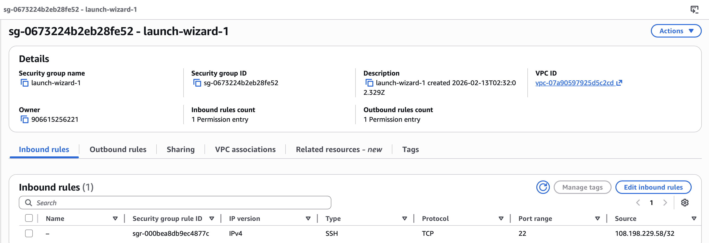
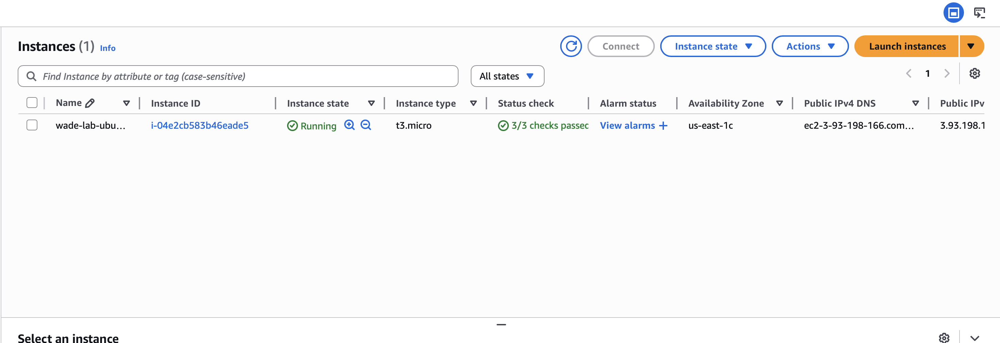
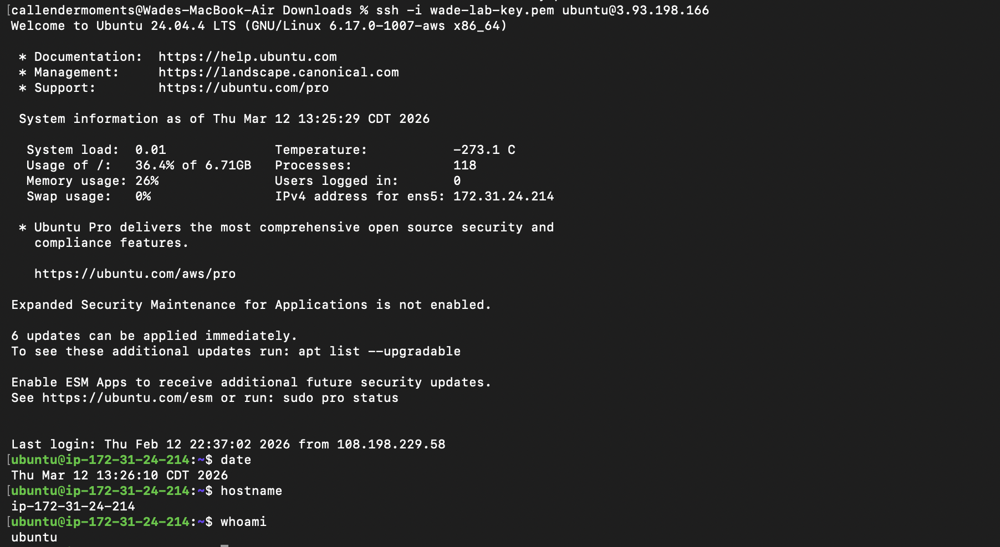
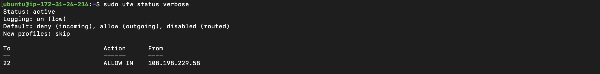
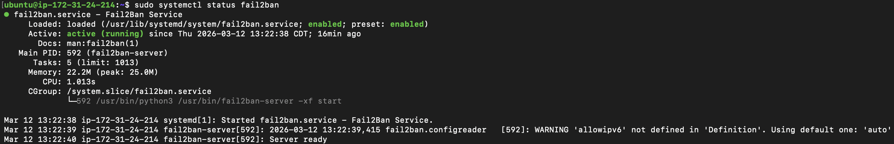
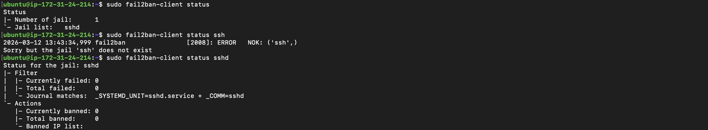
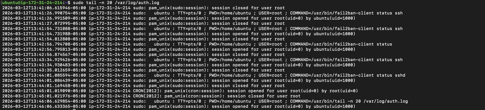
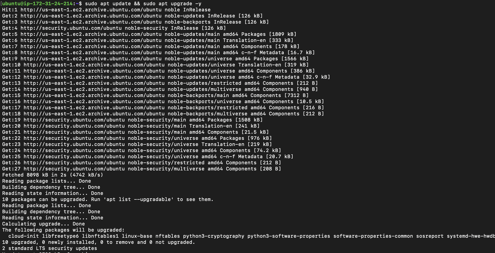
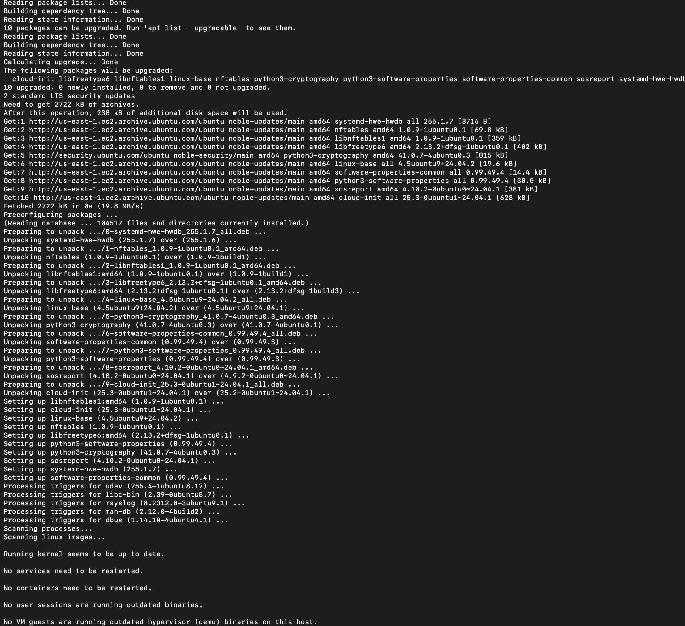

# AWS EC2 Linux Hardening Lab

## Overview
This project documents the deployment and security hardening of an Ubuntu 24.04 LTS instance in AWS EC2.  
The objective was to implement layered security controls, restrict remote access, and simulate brute-force mitigation within a cloud-hosted Linux environment.

---

## Environment
- AWS EC2 (us-east-1)
- Ubuntu 24.04 LTS
- SSH key-based authentication
- UFW (Uncomplicated Firewall)
- Fail2Ban intrusion prevention

---

## Architecture

Local Machine (macOS)
    ↓ SSH (Key-Based)
AWS EC2 Ubuntu Instance
    ↓
Security Controls:
- AWS Security Group (IP restricted)
- UFW Host Firewall
- Fail2Ban SSH monitoring

---

## Security Controls Implemented

### 1. SSH Hardening
- Disabled password authentication
- Disabled root login
- Enforced key-based authentication
- Validated SSH configuration before restart

## Incident Simulation

To validate intrusion prevention controls:

- Attempted failed SSH logins from test user
- Observed authentication failures in `/var/log/auth.log`
- Verified Fail2Ban monitoring of sshd jail
- Confirmed firewall restrictions via UFW rules

Result:
Layered controls successfully restricted unauthorized access attempts.

Configuration file modified:

/etc/ssh/sshd_config

## Security Implementation Evidence

### AWS Security Group Configuration

### EC2 Instance Running

### SSH Login from macOS

### Firewall Protection (UFW)

### SSH Defense Rules

### Fail2Ban Intrusion Prevention

### SSH Brute Force Monitoring

### Authentication Log Monitoring

### Patch Management

